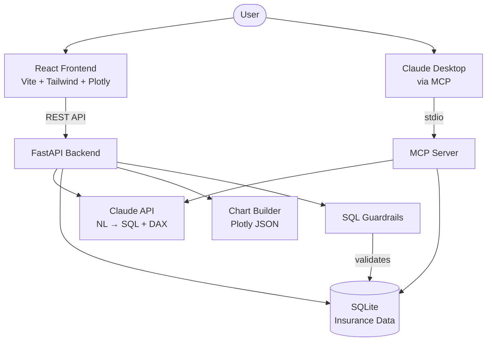

# Analytics Copilot

AI-powered analytics copilot — ask questions in plain English, get SQL, visualizations, and DAX measures.

Built with Python, FastAPI, React, and Claude to demonstrate end-to-end AI-powered analytics workflows.

## Features

- **Natural Language to SQL** — Ask questions like "Total premium by product line" and get accurate SQL
- **Auto-Visualization** — Automatic chart type detection (bar, line, pie, number card) with Plotly
- **DAX Suggestions** — Generate Power BI DAX measures for any query with one click
- **Query History** — Browse and re-run past queries
- **Schema Explorer** — Interactive sidebar showing all tables and columns
- **MCP Server** — Use as a tool in Claude Desktop for conversational analytics
- **SQL Guardrails** — Read-only enforcement prevents any write operations

## Architecture



## Quick Start

### Prerequisites

- Python 3.11+
- Node.js 18+
- [Anthropic API key](https://console.anthropic.com/)

### Setup

```bash
# Clone and enter the project
git clone https://github.com/ryan-bart/analytics-copilot.git
cd analytics-copilot

# Backend
python -m venv .venv
source .venv/bin/activate
pip install -r requirements.txt
cp .env.example .env  # Add your ANTHROPIC_API_KEY

# Seed the database
python -m backend.database.seed

# Start the backend (port 8000)
python -m backend.main

# Frontend (new terminal)
cd frontend
npm install
npm run dev
# Open http://localhost:5173
```

### MCP Server (Claude Desktop)

Add to your Claude Desktop config (`~/Library/Application Support/Claude/claude_desktop_config.json`):

```json
{
  "mcpServers": {
    "analytics-copilot": {
      "command": "/path/to/analytics-copilot/.venv/bin/python",
      "args": ["-m", "backend.mcp_server"],
      "cwd": "/path/to/analytics-copilot"
    }
  }
}
```

## API Reference

| Method | Endpoint | Description |
|--------|----------|-------------|
| `GET` | `/api/health` | Health check |
| `GET` | `/api/schema` | Full database schema |
| `GET` | `/api/schema/{table}` | Single table schema |
| `POST` | `/api/query` | Natural language query → SQL → results |
| `POST` | `/api/dax` | Generate DAX measures for a query |
| `GET` | `/api/history` | Recent query history |
| `GET` | `/api/history/{id}` | Single history item |

## Example Queries

- "How many active policies are there?"
- "Total premium by product line"
- "Monthly claim counts over time"
- "Top 10 customers by total premium"
- "Average claim amount by region"
- "Policy status distribution"

## Tech Stack

| Layer | Technology |
|-------|------------|
| AI | Anthropic Claude API (Sonnet) |
| Backend | Python, FastAPI, SQLAlchemy, SQLite |
| Frontend | React, TypeScript, Vite, Tailwind CSS v4 |
| Visualization | Plotly (server-side JSON → react-plotly.js) |
| MCP | FastMCP with stdio transport |
| Testing | pytest (35 tests) |

## Docker

```bash
cd docker
ANTHROPIC_API_KEY=your-key docker compose up --build
# Frontend: http://localhost:3000
# Backend:  http://localhost:8000
```

## Running Tests

```bash
source .venv/bin/activate
pytest tests/ -v
```

## Dataset

Seeded insurance database with realistic distributions:

- **200** customers across 5 US regions
- **385** policies (Auto, Home, Life, Commercial, Health)
- **341** claims (Collision, Liability, Comprehensive, Property Damage, Medical)
- **871** payments with multiple payment methods
- Data spans 2022–2025

## License

MIT
